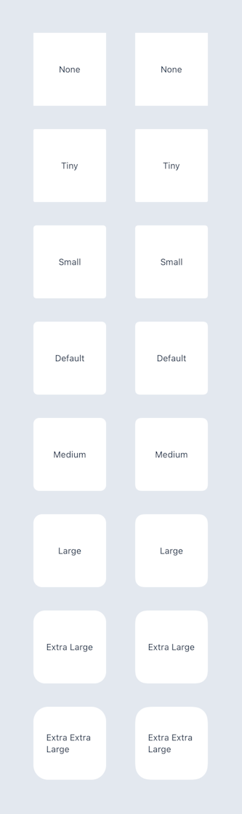

# SensibleStyling

Helpers for sensible SwiftUI styling.

## License

See the LICENSE file for licensing information.

## Table of Contents

- [Sensible Colors](#sensible-colors)
- [Sensible Drop Shadows](#sensible-drop-shadows)
- [Sensible Rounded Corners](#sensible-rounded-corners)

## Sensible Colors

Example usage:

```swift
Rectangle()
    .foregroundColor(.Sensible.slate300)
```


## Sensible Drop Shadows

Example usage:

```swift
Rectangle()
    .foregroundColor(.white)
    .frame(width: 100, height: 100)
    .sensibleShadow(.medium)
```


## Sensible Rounded Corners

Example usage:

```swift
Rectangle()
    .foregroundColor(.white)
    .frame(width: 100, height: 100)
    .sensibleRoundedCorners(.medium)
```


